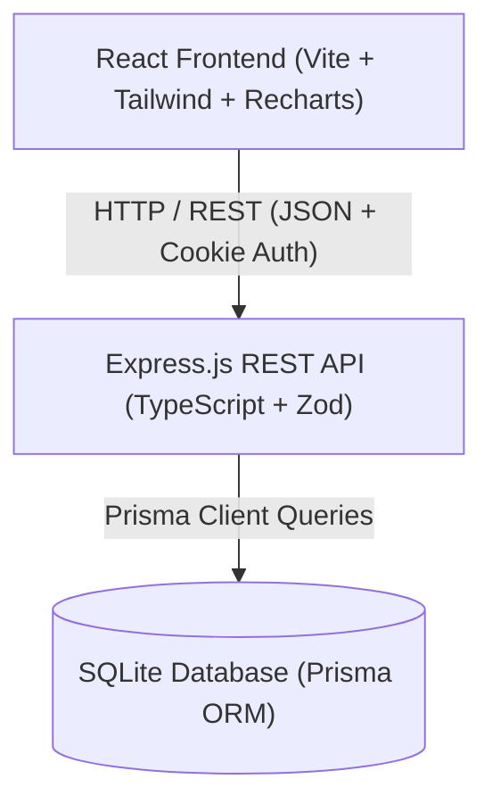
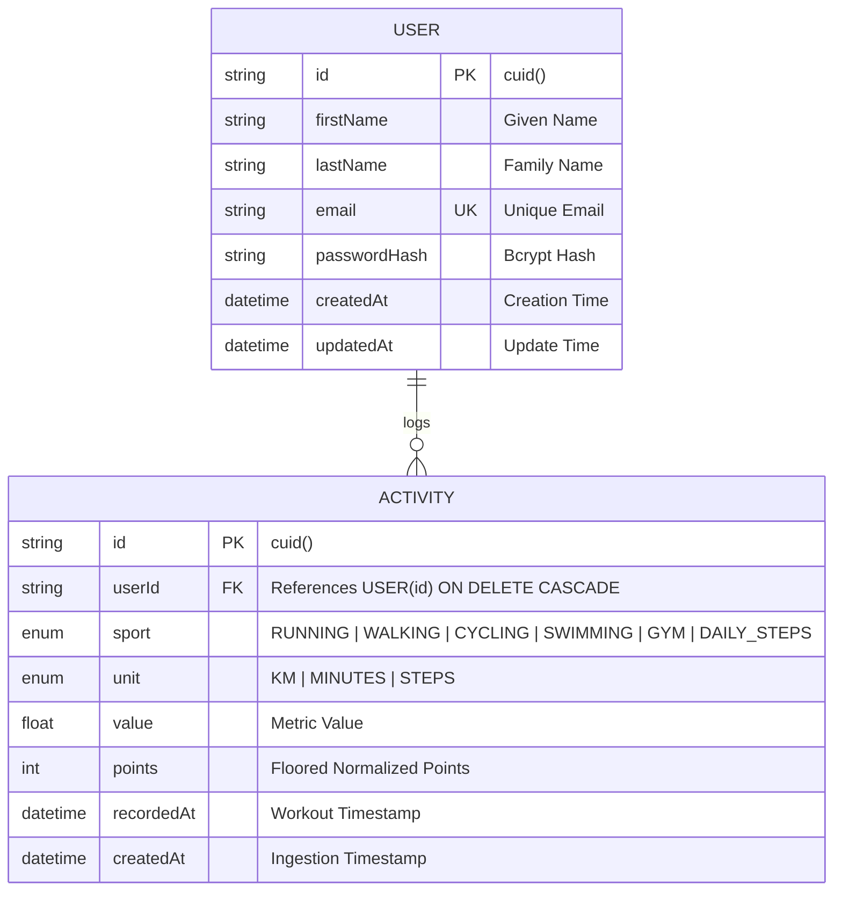

# FitQuest - Software Design Document (Architecture Spec)

FitQuest is a full-stack gamified fitness application that tracks diverse activities (Running, Walking, Cycling, Swimming, Gym, and Daily Steps) and normalizes their metrics into a unified scoring system for global leaderboard competition and personal trend visualization.

---

## Tech Stack
- **Frontend:** React 18 (TypeScript), Vite, Tailwind CSS, Recharts, Lucide Icons, Axios.
- **Backend:** Node.js, Express.js (TypeScript), Zod, bcryptjs, jsonwebtoken, Swagger UI (`/api-docs`).
- **Database:** SQLite (Relational DB) managed via Prisma ORM.

---

## a. System Architecture & Data Flow

### High-Level Architecture
The system employs a 3-tier client-server architecture:
1. **Frontend (SPA):** Handles user interactions, form validation, live score previews, and interactive charts.
2. **Backend API (REST):** Enforces authentication (HttpOnly JWT cookie), input validation via Zod, point normalization, and business logic.
3. **Database (Relational):** Stores users and workout activities with ACID compliance and unique indexing.



### Request / Response Flows

#### 1. User Registration Flow
1. **Client Request:** User submits `firstName`, `lastName`, `email`, and `password` to `POST /api/auth/register`.
2. **Validation:** Zod validates field lengths, email format, and password length (min 8 chars).
3. **Password Hashing:** Password hashed with `bcryptjs` (salt rounds: 10).
4. **Database Insertion & Duplicate Check:**
   - Prisma attempts `prisma.user.create()`.
   - If `[firstName, lastName]` or `email` already exists, a `P2002` unique constraint violation is caught and returned as `409 Conflict`.
5. **Session & Response:** An `HttpOnly` JWT cookie (`accessToken`) is issued, and a `201 Created` response is returned with user details.

#### 2. Activity Data Ingestion & Scoring Flow
1. **Client Request:** Authenticated athlete submits workout details (e.g., `{ sport: "WALKING", distanceKm: 1.55 }`) to `POST /api/activities`.
2. **Authentication:** Middleware verifies JWT cookie and attaches `req.user.id`.
3. **Zod Metric Validation:** Rejects mismatched sport/metric pairings with `400 Bad Request` (e.g., rejecting duration provided for Running).
4. **Point Normalization:** Scoring engine computes floored points (e.g., $\lfloor 1.55 \times 50 \rfloor = 77$ pts).
5. **Persistence:** Workout is saved to the `Activity` table with `userId`, normalized `value`, and calculated `points`.
6. **Response:** Returns `201 Created` with the saved activity object.

---

## b. Database Schema & Data Model

### Entity Relationship Diagram (ERD)



### Table Definitions

#### `User` Model
- `id` (`String`, PK, default: `cuid()`): Unique user ID.
- `firstName` (`String`, NOT NULL): First name.
- `lastName` (`String`, NOT NULL): Last name.
- `email` (`String`, UNIQUE, NOT NULL): Email address.
- `passwordHash` (`String`, NOT NULL): Salted bcrypt password hash.
- `createdAt` / `updatedAt` (`DateTime`): Timestamp audit fields.

#### `Activity` Model
- `id` (`String`, PK, default: `cuid()`): Unique activity ID.
- `userId` (`String`, FK, NOT NULL): Foreign key referencing `User.id` with `ON DELETE CASCADE`.
- `sport` (`Sport` Enum: `RUNNING`, `WALKING`, `CYCLING`, `SWIMMING`, `GYM`, `DAILY_STEPS`).
- `unit` (`MetricUnit` Enum: `KM`, `MINUTES`, `STEPS`).
- `value` (`Float`, NOT NULL): Raw metric stored in standard unit.
- `points` (`Int`, NOT NULL): Integer points awarded after scoring and flooring.
- `recordedAt` (`DateTime`, default: `now()`): When workout took place.
- `createdAt` (`DateTime`, default: `now()`): System creation time.

### Duplicate User Detection Strategy
- **Database Level:** Composite unique constraint `@@unique([firstName, lastName])` and unique index `@unique([email])`.
- **Application Level:** Zod trims input strings before query execution.
- **Error Mapping:** Prisma error code `P2002` is caught by global error middleware and translated to HTTP `409 Conflict`:
  - `"A user with this first and last name already exists"`
  - `"A user with this email already exists"`

### Indexes
- `User`: `@@unique([firstName, lastName])`, `@unique([email])`.
- `Activity`: `@@index([userId])`, `@@index([sport])`, `@@index([recordedAt])`.

---

## c. API Specifications

### Response Envelope
- **Success:** `{ "success": true, "data": { ... } }`
- **Error:** `{ "success": false, "message": "...", "errors"?: [...] }`

---

### 1. User Registration API
- **Route:** `POST /api/auth/register`
- **Auth:** Public
- **Request Body:**
```json
{
  "firstName": "Alex",
  "lastName": "Morgan",
  "email": "alex.morgan@fitquest.io",
  "password": "SecurePassword123!"
}
```
- **Validation Rules:**
  - `firstName`, `lastName`: String, 1–50 characters, trimmed.
  - `email`: Valid email format.
  - `password`: String, 8–128 characters.
- **Responses:**
  - `201 Created`: Returns `{ success: true, data: { user: { id, firstName, lastName, email, createdAt } } }` and sets `accessToken` cookie.
  - `400 Bad Request`: Validation error payload.
  - `409 Conflict`: Duplicate first/last name or email.

---

### 2. Activity Ingestion API
- **Route:** `POST /api/activities`
- **Auth:** Required (`accessToken` cookie)
- **Request Body Examples:**
  - *Distance Sport (Running, Walking, Cycling):*
    ```json
    { "sport": "WALKING", "distanceKm": 1.55, "recordedAt": "2026-08-18T08:30:00Z" }
    ```
  - *Duration Sport (Gym, Swimming):*
    ```json
    { "sport": "SWIMMING", "durationSeconds": 115, "recordedAt": "2026-08-18T08:30:00Z" }
    ```
  - *Count Sport (Daily Steps):*
    ```json
    { "sport": "DAILY_STEPS", "steps": 399, "recordedAt": "2026-08-18T08:30:00Z" }
    ```
- **Validation Rules (Zod Discriminated Logic):**
  - Distance sports (`RUNNING`, `WALKING`, `CYCLING`) require `distanceKm > 0`; disallow `durationSeconds` and `steps`.
  - Duration sports (`SWIMMING`, `GYM`) require `durationSeconds > 0`; disallow `distanceKm` and `steps`.
  - Count sports (`DAILY_STEPS`) require `steps > 0` (integer); disallow `distanceKm` and `durationSeconds`.
- **Responses:**
  - `201 Created`: `{ success: true, data: { activity: { id, sport, unit, value, points, recordedAt } } }`
  - `400 Bad Request`: Validation or metric mismatch error.
  - `401 Unauthorized`: Missing or invalid session cookie.

---

### 3. Additional Key Endpoints
- **`POST /api/auth/login`**: Authenticates user credentials and sets HttpOnly cookie.
- **`GET /api/auth/me`**: Returns current authenticated user profile.
- **`POST /api/auth/logout`**: Clears session cookie.
- **`GET /api/activities`**: Returns authenticated user's activity history list.
- **`DELETE /api/activities/:id`**: Deletes activity owned by authenticated user (`403` if unauthorized).
- **`GET /api/leaderboard?timeframe=this_week|this_month|all_time`**: Returns ranked leaderboard entries with top users and current user's position.

---

## d. Scoring & Normalization Logic

### Conversion Matrix & Flooring Rules

| Activity | Metric Category | Conversion Rate | Primary Flooring Step | Points Formula |
| :--- | :--- | :--- | :--- | :--- |
| **Running** | Distance ($\text{km}$) | $100\text{ pts} / 1\text{ km}$ | None | $\lfloor \text{distanceKm} \times 100 \rfloor$ |
| **Walking** | Distance ($\text{km}$) | $50\text{ pts} / 1\text{ km}$ | None | $\lfloor \text{distanceKm} \times 50 \rfloor$ |
| **Cycling** | Distance ($\text{km}$) | $25\text{ pts} / 1\text{ km}$ | None | $\lfloor \text{distanceKm} \times 25 \rfloor$ |
| **Swimming** | Duration ($\text{seconds}$) | $15\text{ pts} / 1\text{ min}$ | Whole minutes: $\lfloor \frac{\text{seconds}}{60} \rfloor$ | $\lfloor \frac{\text{seconds}}{60} \rfloor \times 15$ |
| **Gym** | Duration ($\text{seconds}$) | $5\text{ pts} / 1\text{ min}$ | Whole minutes: $\lfloor \frac{\text{seconds}}{60} \rfloor$ | $\lfloor \frac{\text{seconds}}{60} \rfloor \times 5$ |
| **Daily Steps** | Count ($\text{steps}$) | $1\text{ pt} / 100\text{ steps}$ | 100-step blocks: $\lfloor \frac{\text{steps}}{100} \rfloor$ | $\lfloor \frac{\text{steps}}{100} \rfloor \times 1$ |

### Worked Calculation Examples
- **Walking (1.55 km):** $1.55 \times 50 = 77.5 \rightarrow \mathbf{77\text{ points}}$ (floored).
- **Swimming (1 min 55 sec = 115 sec):** $\lfloor 115 / 60 \rfloor = 1\text{ min} \times 15 \rightarrow \mathbf{15\text{ points}}$ (seconds floored to whole minute).
- **Gym (45 min 30 sec = 2730 sec):** $\lfloor 2730 / 60 \rfloor = 45\text{ min} \times 5 \rightarrow \mathbf{225\text{ points}}$.
- **Daily Steps (399 steps):** $\lfloor 399 / 100 \rfloor = 3\text{ blocks} \times 1 \rightarrow \mathbf{3\text{ points}}$ (floored to nearest 100).
- **Daily Steps (9,875 steps):** $\lfloor 9875 / 100 \rfloor = 98\text{ blocks} \times 1 \rightarrow \mathbf{98\text{ points}}$.

### Implementation (`backend/src/utils/scoring.ts`)
```typescript
export function calculatePoints(sport: Sport, rawValue: number): number {
  switch (sport) {
    case Sport.RUNNING:     return Math.floor(rawValue * 100);
    case Sport.WALKING:     return Math.floor(rawValue * 50);
    case Sport.CYCLING:     return Math.floor(rawValue * 25);
    case Sport.SWIMMING:    return Math.floor(rawValue / 60) * 15;
    case Sport.GYM:         return Math.floor(rawValue / 60) * 5;
    case Sport.DAILY_STEPS: return Math.floor(rawValue / 100);
  }
}
```

---

## e. Frontend Architecture & Visualizations

### Component Structure
```
frontend/src/
├── components/
│   ├── leaderboard/
│   │   ├── LeaderboardPodium.tsx    # Top-3 Olympic visual podium (Gold, Silver, Bronze)
│   │   └── LeaderboardTable.tsx     # Ranked table with search, user highlight & activity tags
│   ├── dashboard/
│   │   ├── StatCard.tsx             # 4 hero stats (Total Points, Activities, Rank, Streak)
│   │   ├── PointsOverTimeChart.tsx  # 7-day chronological points accumulation (Recharts Area)
│   │   ├── ActivityMixChart.tsx     # Sport preference percentage donut (Recharts Pie)
│   │   ├── RecentActivitiesList.tsx # Chronological workout history stream
│   │   └── QuestCard.tsx           # Gamified weekly goal progress tracker
│   └── activities/
│       ├── LogActivityForm.tsx      # Workout form with real-time live points preview
│       └── ActivityCard.tsx         # Workout display item with delete action
└── pages/
    ├── DashboardPage.tsx            # Personal fitness trends & analytics
    ├── LeaderboardPage.tsx          # Global competition rankings & filters
    ├── ActivitiesPage.tsx           # Workouts management view
    ├── LoginPage.tsx / RegisterPage.tsx # Auth pages
```

### Visualizations & Ranking Strategy
1. **Global Leaderboard (`LeaderboardPage`):**
   - **Podium:** Displays top 3 athletes with gold/silver/bronze badges and recent activity chips.
   - **Table:** Renders remaining ranked athletes with live search filtering and current user highlight.
   - **Ranking Strategy:** Aggregates user points by timeframe (`this_week`, `this_month`, `all_time`), sorted descending by `points` (secondary sort: `activitiesCount DESC`). Ranks are assigned 1-indexed.
2. **Personal Dashboard (`DashboardPage`):**
   - **Points Over Time:** Recharts AreaChart plotting the last 7 days of points accumulation with custom gradients.
   - **Activity Mix:** Recharts Donut chart visualizing distribution across sport types.
   - **Active Streak:** Calculates consecutive workout days.
   - **Weekly Quest:** Tracks progress toward 5 workouts/week with celebration bonus indicators.
3. **Interactive Logging Form (`LogActivityForm`):**
   - Dynamically changes inputs based on sport selection (distance vs duration vs steps).
   - Computes points live on keystroke so athletes see earned points before clicking Submit.

---

## f. Trade-offs & Edge Cases

### Technical Trade-offs
1. **SQLite vs Distributed Database:** SQLite provides lightweight, zero-configuration local setup; Prisma ORM enables clean migration to PostgreSQL/MySQL in production without application code changes.
2. **On-the-Fly Aggregation vs Materialized Views:** Dynamic SQL aggregation guarantees 100% real-time leaderboard accuracy upon activity creation/deletion without cache invalidation race conditions.
3. **HttpOnly Cookie Auth vs LocalStorage Tokens:** HttpOnly cookies protect JWTs against XSS token harvesting, with `SameSite=Lax` mitigating CSRF risks.
4. **Duration in Seconds vs Fractional Minutes:** Enforcing duration in integer seconds (`durationSeconds`) avoids floating-point rounding ambiguity (e.g. distinguishing 1 min 55 sec vs 1.55 min).

### Edge Case Handling

| Edge Case | Risk | Mitigation |
| :--- | :--- | :--- |
| **Concurrent Duplicate Names** | Two users register with the same name simultaneously. | SQLite compound unique index `@@unique([firstName, lastName])` throws `P2002`, returning `409 Conflict`. |
| **Whitespace Variations** | `"Alex  Morgan"` vs `"Alex Morgan"`. | Zod `.trim()` cleans all string fields before validation and persistence. |
| **Mismatched Sport & Metric** | Submitting distance for Gym or duration for Running. | Zod `superRefine()` strictly enforces required metric and rejects mismatched fields with `400 Bad Request`. |
| **Sub-Unit Activity Values** | Submitting 99 steps or 50 seconds Gym. | Mathematical flooring cleanly awards `0 points` without crashing or throwing errors. |
| **Negative or Zero Values** | Submitting negative distance/duration. | Zod `.positive()` rejects non-positive numbers with `400 Bad Request`. |
| **Unauthorized Deletion** | User A tries to delete User B's activity. | Service checks `activity.userId === req.user.id`, throwing `403 Forbidden` on mismatch. |
| **Timezone Alignment** | Workouts logged across different timezones. | All timestamps stored in UTC (`ISO-8601`); client renders them relative to local athlete time. |
